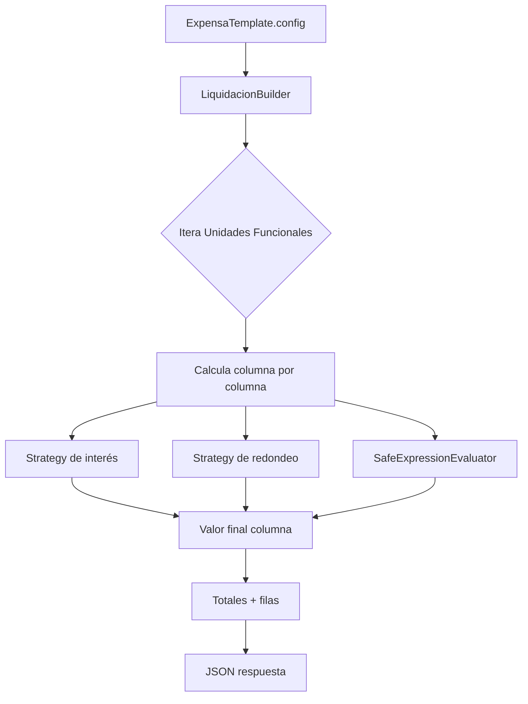

# Documentación técnica — Motor de liquidación de expensas

## 1) Visión General
El motor de liquidación es dinámico y se basa en templates JSON almacenados en base de datos a través de `ExpensaTemplate`. Cada template define columnas, reglas de cálculo y parámetros de redondeo, lo que permite construir liquidaciones sin cambios de código.

- Template (metadata): [backend/expensas/models.py](backend/expensas/models.py)
- Builder principal: [backend/expensas/builder.py](backend/expensas/builder.py)
- Evaluador seguro de fórmulas: [backend/expensas/utils.py](backend/expensas/utils.py)

## 2) Arquitectura Backend

### 2.1 Patrón Builder
El `LiquidacionBuilder` orquesta la liquidación recorriendo las Unidades Funcionales, calculando cada columna en el orden definido por el template y acumulando totales.

- Fuente de configuración: `ExpensaTemplate.config`
- Entradas: consorcio, periodo, parámetros dinámicos
- Salida: JSON con columnas dinámicas, filas por UF y totales

### 2.2 Patrón Strategy
Se usan estrategias para encapsular cálculos que pueden variar sin modificar el Builder:

- `InterestStrategy`: `SimpleInterestStrategy`, `CompoundInterestStrategy`, `EarlyPaymentStrategy`
- `RoundingStrategy`: `NoRoundingStrategy`, `StepRoundingStrategy`, `CeilingRoundingStrategy`, `FloorRoundingStrategy`

Esto permite incorporar nuevos métodos de interés o redondeo sin tocar la lógica de liquidación.

### 2.3 Evaluación segura de fórmulas
`SafeExpressionEvaluator` evalúa expresiones definidas por el usuario usando AST, limitando operaciones aritméticas y acceso a variables conocidas. Esto evita ejecución de código arbitrario.

### 2.4 Modelos de datos principales
- `ExpensaTemplate`: define el template JSON de la liquidación (columnas, redondeos, metadata).
- `ExpensaRule`: reglas asociadas al template (reservado para futuras extensiones o reglas complementarias).
- `LiquidacionExpensa`: snapshot inmutable del resultado cuando la liquidación se cierra.

### 2.5 Flujo interno (Builder + Strategies)


## 3) API y Flujo de Datos

### 3.1 Endpoint
`POST /api/liquidar/`

Implementación: [backend/expensas/views.py](backend/expensas/views.py)

### 3.2 Payload (request)
```json
{
  "template_id": 1,
  "consorcio": "20304050607",
  "periodo": "2026-02",
  "cerrar": false,
  "parametros": {
    "conceptos_particulares": [
      { "unidad": 1, "column_id": "reparaciones", "monto": "1200.00" }
    ],
    "coeficientes_custom": { "1": "0.6", "2": "0.4" }
  }
}
```

**Campos clave**:
- `template_id`: ID del template a ejecutar.
- `consorcio`: CUIT del consorcio.
- `periodo`: `YYYY-MM` o `YYYY-MM-DD` (se normaliza al primer día del mes).
- `cerrar`: si es `true`, persiste `LiquidacionExpensa`.
- `parametros`: inputs opcionales para conceptos particulares o coeficientes custom.

### 3.3 Respuesta (response)
El backend devuelve columnas y filas dinámicas para renderizar la tabla:

```json
{
  "status": "success",
  "data": {
    "consorcio": "20304050607",
    "periodo": "2026-02-01",
    "template_id": 1,
    "columns": [
      { "id": "saldo_anterior", "label": "Saldo anterior", "visible": true, "calc_type": "saldo_anterior" },
      { "id": "interes", "label": "Interés", "visible": true, "calc_type": "interes" }
    ],
    "unidades": [
      {
        "numero_unidad_funcional": 1,
        "propietario": "María",
        "apellido": "Pérez",
        "valores": {
          "saldo_anterior": "10000.00",
          "interes": "500.00"
        }
      }
    ],
    "totales": {
      "saldo_anterior": "10000.00",
      "interes": "500.00"
    }
  }
}
```

**Notas**:
- `columns` define la estructura dinámica a pintar en la UI.
- `unidades[].valores` es un diccionario donde la clave coincide con `columns[].id`.
- `totales` replica ese mismo esquema para el pie de la tabla.

## 4) Integración Frontend

El `SettlementComponent` consume el endpoint y renderiza una tabla dinámica a partir de `columns`. La transformación principal se realiza en `mapToTableState()`, que:

1. Filtra columnas con `visible !== false`.
2. Mapea cada unidad a una fila, asignando `row[column.id] = unidad.valores[column.id]`.
3. Usa `SettlementValuePipe` para formatear valores según metadata.

Implementación:
- Componente: [frontend/src/app/components/pages/settlement/settlement.ts](frontend/src/app/components/pages/settlement/settlement.ts)
- Vista: [frontend/src/app/components/pages/settlement/settlement.html](frontend/src/app/components/pages/settlement/settlement.html)
- Servicio: [frontend/src/app/services/settlement.service.ts](frontend/src/app/services/settlement.service.ts)

---

### Resumen de extensión
- Para nuevos métodos de interés: agregar una nueva implementación de `InterestStrategy` en [backend/expensas/strategies.py](backend/expensas/strategies.py) y mapearla en `LiquidacionBuilder`.
- Para nuevos criterios de redondeo: agregar una `RoundingStrategy` y registrarla en `_build_rounding_strategy()`.
- Para nuevas variables en fórmulas: inyectarlas en el `context` dentro de `LiquidacionBuilder.build()`.
